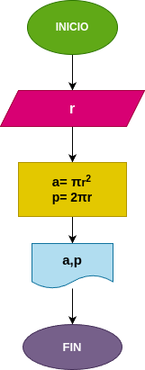

# Programa 1: area_perimetro_circulo
programa en Phyton para calcular el area y el perimetro de un circulo, dado el valor de su radio

## Análisis

### Variable de entrada
- r: radio del circulo

### Procesamiento
- a: area del circulo
- p: perimetro del circulo

$a = \pi*r^2$

$p = 2*\pi*r$

## Diseño

## construcción
- codigo implementado en el archivo area_perimetro_circulo.py

